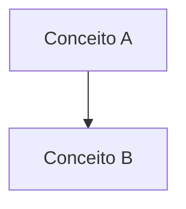

# 🤝 Guia de Contribuição

Obrigado por considerar contribuir com a Escola de Estudos! Este guia ajudará você a adicionar novas trilhas ou melhorar o conteúdo existente.

## 📋 Como Adicionar uma Nova Trilha

### 1. Estrutura Básica

Crie uma nova pasta em `trilhas/` seguindo este padrão:

```
trilhas/nova-trilha/
├── README.md
├── 00-introducao.md
├── 01-primeiro-topico.md
├── 02-segundo-topico.md
├── exercicios/
│   └── README.md
└── recursos/
    └── referencias.md
```

### 2. Template de README da Trilha

Cada trilha deve ter um `README.md` com:

- Título e descrição da trilha
- Objetivos de aprendizado
- Pré-requisitos
- Índice dos módulos
- Progressão sugerida

### 3. Template de Módulo

Cada módulo deve seguir esta estrutura:

```markdown
# Título do Módulo

## 📘 Nível Básico

### Conceito
[Explicação do conceito]

### Exemplo
[Exemplo simples]

## 📗 Nível Intermediário

### Aplicação Prática
[Como aplicar na prática]

### Casos de Uso
[Exemplos reais]

## 📕 Nível Avançado

### Padrões Relacionados
[Padrões e técnicas avançadas]

### Integração
[Como integrar com outros conceitos]

## ✅ Checkpoint

### Auto-avaliação
- [ ] Entendi o conceito básico
- [ ] Consigo aplicar na prática
- [ ] Entendo as aplicações avançadas

### Próximos Passos
- [Próximo módulo](./02-proximo.md)
```

### 4. Atualizar Índices

Após criar a trilha, atualize:

- `README.md` principal (adicionar na lista de trilhas)
- `INDEX.md` (adicionar todos os módulos)

## ✏️ Como Melhorar Conteúdo Existente

### Adicionar Exemplos

- Use múltiplas linguagens quando possível
- Priorize TypeScript/JavaScript
- Inclua exemplos "antes" e "depois"

### Adicionar Diagramas

Use Mermaid para diagramas:

```markdown

```

### Adicionar Exercícios

Crie exercícios em `trilhas/[trilha]/exercicios/`:

- Exercícios progressivos (fácil → difícil)
- Inclua soluções comentadas
- Adicione desafios opcionais

## 📝 Padrões de Escrita

### Linguagem

- Use português brasileiro
- Seja claro e objetivo
- Evite jargões desnecessários
- Explique termos técnicos na primeira menção

### Formatação

- Use títulos hierárquicos (##, ###)
- Destaque código com syntax highlighting
- Use listas para melhor legibilidade
- Inclua links internos entre módulos

### Código

- Sempre inclua exemplos práticos
- Comente código complexo
- Mostre versões "ruim" e "boa"
- Use nomes descritivos

## 🎯 Checklist para Nova Trilha

- [ ] Pasta criada em `trilhas/`
- [ ] README.md da trilha criado
- [ ] Módulos numerados (00, 01, 02...)
- [ ] Cada módulo tem conteúdo básico, intermediário e avançado
- [ ] Pasta de exercícios criada
- [ ] Pasta de recursos criada
- [ ] README.md principal atualizado
- [ ] INDEX.md atualizado
- [ ] Links internos funcionando
- [ ] Exemplos de código testados

## 🔍 Revisão

Antes de submeter:

1. Revise ortografia e gramática
2. Teste todos os links
3. Verifique formatação markdown
4. Confirme que exemplos de código estão corretos
5. Valide diagramas Mermaid

## 📚 Recursos Úteis

- [Markdown Guide](https://www.markdownguide.org/)
- [Mermaid Documentation](https://mermaid.js.org/)
- Templates em `templates/`

## ❓ Dúvidas?

Se tiver dúvidas sobre como contribuir, abra uma issue ou consulte as trilhas existentes como referência.

---

Obrigado por contribuir! 🎉
