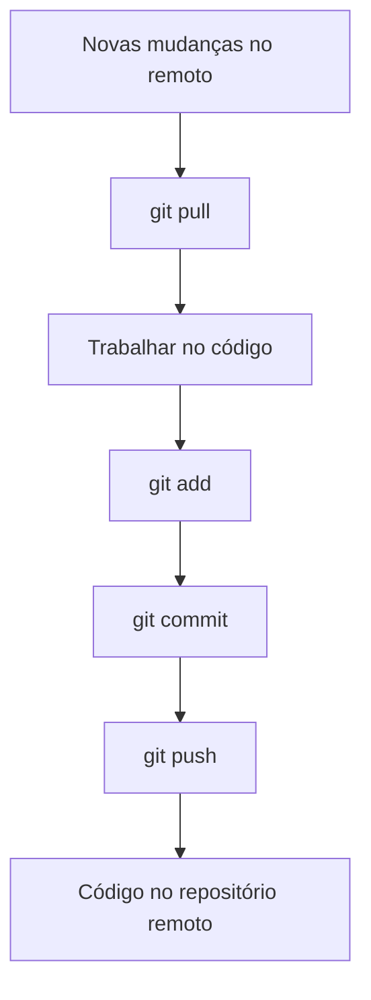

# 00 - Introdução ao Git

## 📖 O que é Git?

Git é um **sistema de controle de versão distribuído** criado por Linus Torvalds em 2005. Ele permite rastrear mudanças no código fonte durante o desenvolvimento de software, facilitando a colaboração entre equipes.

### Por que Git é importante?

- **Histórico completo**: Todas as mudanças são registradas
- **Colaboração**: Múltiplas pessoas podem trabalhar no mesmo projeto
- **Backup**: Código seguro contra perdas
- **Experimentação**: Crie branches para testar novas ideias
- **Padrão da indústria**: Usado por praticamente todas as empresas de tecnologia

## 🎯 Conceitos Fundamentais

### Repositório (Repository)
Local onde o Git armazena o histórico de todas as versões do seu projeto.

### Commit
Uma "fotografia" do estado do seu código em um momento específico.

### Branch
Uma linha independente de desenvolvimento. Permite trabalhar em features sem afetar o código principal.

### Merge
Unir mudanças de uma branch para outra.

### Clone
Copiar um repositório existente para sua máquina local.

### Push/Pull
Enviar ou receber mudanças entre repositório local e remoto.

## 📋 O que você vai aprender

### Nesta trilha:
- ✅ Comandos básicos do Git
- ✅ Trabalhar com branches
- ✅ Resolver conflitos
- ✅ Colaboração em equipe
- ✅ Estratégias de branching (GitFlow)

### Pré-requisitos:
- Editor de código (VS Code recomendado)
- Conta no GitHub/GitLab/Bitbucket
- Terminal/Console familiaridade básica

## 🚀 Primeiro Passo Prático

### Verificar Instalação

Abra o terminal e execute:

```bash
# Verificar versão do Git
git --version

# Deve mostrar algo como: git version 2.34.1
```

Se não estiver instalado, consulte o README principal para instruções de instalação.

### Configuração Inicial

```bash
# Configurar nome (use seu nome real)
git config --global user.name "Seu Nome Completo"

# Configurar email (use o mesmo do GitHub)
git config --global user.email "seu.email@exemplo.com"

# Configurar editor padrão (VS Code)
git config --global core.editor "code --wait"

# Verificar configurações
git config --list
```

## 📁 Estrutura de um Projeto Git

```
meu-projeto/
├── .git/           # Pasta oculta com histórico Git
├── README.md       # Documentação do projeto
├── src/           # Código fonte
├── tests/         # Testes
└── .gitignore     # Arquivos ignorados
```

## 🔄 Fluxo Básico de Trabalho



## 🎯 Exercício Prático

### Criar seu primeiro repositório

1. **Criar pasta do projeto:**
   ```bash
   mkdir meu-primeiro-repo
   cd meu-primeiro-repo
   ```

2. **Inicializar repositório Git:**
   ```bash
   git init
   ```

3. **Criar arquivo README:**
   ```bash
   echo "# Meu Primeiro Repositório Git" > README.md
   echo "" >> README.md
   echo "Este é meu primeiro projeto usando Git!" >> README.md
   ```

4. **Verificar status:**
   ```bash
   git status
   ```

5. **Adicionar arquivo:**
   ```bash
   git add README.md
   ```

6. **Fazer commit:**
   ```bash
   git commit -m "feat: adicionar README inicial"
   ```

7. **Verificar histórico:**
   ```bash
   git log --oneline
   ```

### Resultado esperado:
```
$ git log --oneline
abc1234 feat: adicionar README inicial
```

## 📚 Termos Importantes

| Termo | Definição |
|-------|-----------|
| **Working Directory** | Pasta onde você trabalha nos arquivos |
| **Staging Area** | Área onde prepara mudanças para commit |
| **Repository** | Banco de dados com histórico de commits |
| **Commit** | Unidade básica de mudança no Git |
| **Branch** | Linha independente de desenvolvimento |
| **Merge** | Unir mudanças de branches diferentes |
| **Conflict** | Quando Git não consegue fazer merge automático |
| **Remote** | Repositório remoto (GitHub, GitLab, etc.) |

## ✅ Verificação - Você está pronto?

Para prosseguir para o próximo módulo, certifique-se de:

- [ ] Git instalado e funcionando
- [ ] Configurado nome e email
- [ ] Criou seu primeiro repositório
- [ ] Fez pelo menos um commit
- [ ] Entende os conceitos básicos

## 🎯 O que vem a seguir?

No próximo módulo, vamos aprofundar nos **comandos básicos** do Git e aprender a trabalhar com arquivos, pastas e múltiplas mudanças.

---

[← Voltar à trilha](../README.md) | [Próximo: Comandos Básicos →](./01-comandos-basicos.md)