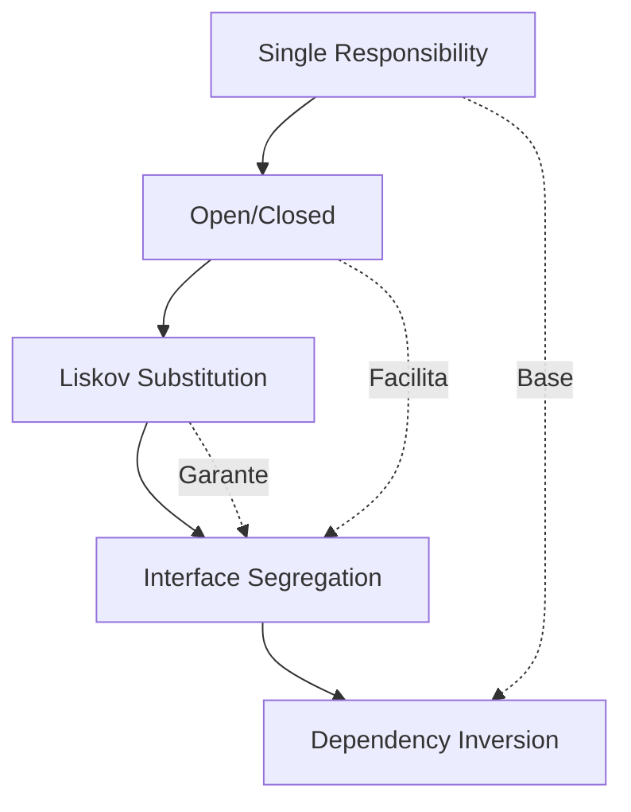

# 00 - Introdução aos Princípios SOLID

## 📘 Nível Básico

### O que é SOLID?

SOLID é um acrônimo que representa cinco princípios fundamentais de design orientado a objetos. Estes princípios foram introduzidos por Robert C. Martin (conhecido como "Uncle Bob") e são considerados essenciais para escrever código de qualidade.

### O Acrônimo SOLID

- **S** - Single Responsibility Principle (Princípio da Responsabilidade Única)
- **O** - Open/Closed Principle (Princípio Aberto/Fechado)
- **L** - Liskov Substitution Principle (Princípio de Substituição de Liskov)
- **I** - Interface Segregation Principle (Princípio de Segregação de Interface)
- **D** - Dependency Inversion Principle (Princípio de Inversão de Dependência)

### Por que SOLID é importante?

Os princípios SOLID ajudam a:

- **Manter código limpo**: Código que segue SOLID é mais fácil de ler e entender
- **Facilitar manutenção**: Mudanças futuras são mais simples e seguras
- **Permitir extensibilidade**: Adicionar novas funcionalidades não quebra código existente
- **Melhorar testabilidade**: Código SOLID é mais fácil de testar
- **Reduzir acoplamento**: Componentes são menos dependentes uns dos outros
- **Aumentar coesão**: Cada componente tem uma responsabilidade clara

### Contexto Histórico

#### A Evolução da Programação Orientada a Objetos

Os princípios SOLID surgiram como resposta à necessidade crescente de princípios de projeto de software. Para entender sua origem, é importante conhecer a evolução da programação orientada a objetos:

**Década de 1960: Os Primórdios**

Na década de 1960, os computadores estavam se tornando mais sofisticados, exigindo novas abordagens de programação para lidar com sistemas cada vez mais complexos. A necessidade de modelar sistemas computacionais de maneira mais próxima da realidade levou os cientistas da computação a buscar paradigmas de programação mais expressivos.

- **Simula 67 (1967)**: Criada por Ole-Johan Dahl e Kristen Nygaard na Noruega, foi a primeira linguagem orientada a objetos. Introduziu conceitos fundamentais:
  - **Classes**: Primeira implementação formal de agrupamento de dados e comportamentos
  - **Objetos**: Instâncias de classes que podiam representar entidades do mundo real
  - **Herança**: Mecanismo para reutilização e extensão de código
  
  Seu objetivo original era simular sistemas complexos, como processos industriais e sistemas de tráfego.

**Década de 1970: A Revolução do Smalltalk**

- **Smalltalk (1972)**: Em 1972, Alan Kay liderou uma equipe no Xerox PARC desenvolvendo a linguagem Smalltalk, projetada para ser completamente orientada a objetos, com foco em mensagens entre objetos. A linguagem popularizou a ideia radical de "objetos como agentes que se comunicam", transformando a programação de uma sequência de instruções para um modelo de interação dinâmica entre componentes computacionais.

**Década de 1980: Consolidação e Popularização**

- **1980**: Consolidação e popularização inicial dos conceitos de programação orientada a objetos
- **1983**: Desenvolvimento do Objective-C pela Apple, expandindo a aplicação prática da orientação a objetos
- **1985**: Lançamento do C++, incorporando conceitos fundamentais como encapsulamento e polimorfismo
- **1986**: Lançamento do Eiffel, linguagem que introduz formalmente o conceito de "programação por contrato", permitindo especificações rigorosas de comportamento e interação entre objetos
- **1988**: Publicação do livro "Object-Oriented Software Construction" por Bertrand Meyer de forma mais teórica, incluindo o uso de "Contratos"

**Década de 1990: Mainstream e Padrões**

- **1989-1991**: Python lançada com suporte a Programação Orientada a Objetos, oferecendo sintaxe simples e legível
- **1993/1995**: Ruby criada, fortemente inspirada nos conceitos da Smalltalk, priorizando a produtividade do desenvolvedor
- **1994**: Publicação de "Design Patterns" pelos Gang of Four (GoF), revolucionando arquiteturas de software orientado a objetos
- **1995**: Java lançada pela Sun Microsystems, popularizando OO e tornando-a acessível para desenvolvimento em larga escala

**Anos 2000+: Modernização**

- **C# (2000)**: Lançada pela Microsoft, rapidamente se estabeleceu como uma linguagem robustamente orientada a objetos, inspirada em Java e C++
- **Kotlin (2011)**: Revolucionou o desenvolvimento Android com sintaxe moderna e suporte completo a programação orientada a objetos
- **Swift (2014)**: Introduzida pela Apple, substituiu Objective-C com uma abordagem mais segura e expressiva de orientação a objetos
- **Scala**: Combina programação funcional e orientada a objetos de forma única, oferecendo grande flexibilidade para desenvolvimento complexo

#### A Necessidade dos Princípios SOLID

Com o crescimento da complexidade do software, surgiu a necessidade de:

1. **Complexidade Crescente**: O software se tornou cada vez mais complexo, exigindo novas formas de organização e estruturação para garantir a qualidade, manutenibilidade e escalabilidade.

2. **Manutenção e Extensibilidade**: O software também precisava ser mais fácil de manter e estender, para lidar com as constantes mudanças e evoluções dos requisitos.

#### Origem dos Princípios SOLID

Os princípios SOLID surgiram como uma resposta a essa necessidade de princípios de projeto de software. Foram **compostos** por Robert C. Martin (Uncle Bob) no início dos anos 2000, mas representam um **trabalho coletivo** de especialistas que refinaram conceitos de design de software orientado a objetos ao longo de décadas.

**Um Trabalho Coletivo: Contribuições de Especialistas**

Os princípios SOLID não surgiram de um único autor, mas representam uma colaboração de mentes brilhantes da computação:

- **Barbara Liskov**: Introduziu o Princípio da Substituição de Liskov (LSP) em 1987, fundamental para garantir que classes derivadas possam substituir suas classes base sem quebrar o comportamento do programa.

- **Bertrand Meyer**: Criador do Princípio Aberto/Fechado (OCP) e pioneiro na ideia de Programação por Contrato, estabelecendo bases para design de software mais robusto e extensível.

- **Jim Coplien**: Contribuiu significativamente com padrões de linguagem e arquiteturas organizacionais que influenciaram profundamente o pensamento em design orientado a objetos.

- **Robert C. Martin (Uncle Bob)**: Compilou e formalizou os princípios SOLID, criando o acrônimo e popularizando os conceitos através de seus livros e palestras.

**Referências:**
- Livro: "Agile Software Development: Principles, Patterns, and Practices" - Robert C. Martin
- Livro: "Object-Oriented Software Construction" - Bertrand Meyer

## 📗 Nível Intermediário

### Como os Princípios se Relacionam

Os princípios SOLID não são independentes - eles trabalham juntos para criar um design coeso:

**Relações principais:**

1. **SRP é a base**: Sem responsabilidades únicas, é difícil aplicar outros princípios
2. **OCP depende de SRP**: Para estender sem modificar, precisamos de classes focadas
3. **LSP garante ISP**: Substituição correta permite interfaces menores
4. **DIP integra tudo**: Inversão de dependências conecta todos os princípios

### Benefícios Práticos

#### Manutenibilidade

Código que segue SOLID é mais fácil de manter porque:

- Mudanças são localizadas (SRP)
- Novas features não quebram código existente (OCP)
- Substituições são seguras (LSP)
- Interfaces são específicas (ISP)
- Dependências são flexíveis (DIP)

#### Testabilidade

SOLID facilita testes porque:

- Classes pequenas são mais fáceis de testar
- Dependências podem ser mockadas facilmente
- Comportamentos isolados são testáveis independentemente

#### Escalabilidade

Projetos SOLID escalam melhor porque:

- Novos desenvolvedores entendem o código mais rápido
- Features podem ser desenvolvidas em paralelo
- Refatorações são mais seguras

## 📕 Nível Avançado

### SOLID e Arquitetura

Os princípios SOLID não se aplicam apenas a classes individuais - eles influenciam arquitetura de software:

- **Camadas**: Cada camada tem responsabilidades distintas (SRP)
- **Módulos**: Módulos são extensíveis sem modificação (OCP)
- **Contratos**: Interfaces definem contratos claros (LSP, ISP)
- **Inversão**: Camadas superiores não dependem de inferiores (DIP)

### SOLID e Design Patterns

Muitos padrões de design implementam princípios SOLID:

- **Strategy Pattern**: Implementa OCP e DIP
- **Factory Pattern**: Aplica DIP
- **Adapter Pattern**: Resolve problemas de ISP
- **Template Method**: Usa LSP

### Críticas e Limitações

É importante entender que SOLID não é uma solução universal:

- **Não é dogma**: Aplique com bom senso, não cegamente
- **Trade-offs existem**: Às vezes flexibilidade tem custo
- **Contexto importa**: Nem sempre todos os princípios se aplicam
- **Over-engineering**: Não crie abstrações desnecessárias

### Quando Aplicar SOLID

SOLID é especialmente valioso quando:

- Projeto tem vida longa
- Múltiplos desenvolvedores trabalham no código
- Requisitos mudam frequentemente
- Código precisa ser testável
- Manutenção é uma preocupação

## 🎯 Estrutura da Trilha

Esta trilha está organizada para você aprender progressivamente:

1. **Módulos 01-05**: Um princípio por módulo, do básico ao avançado
2. **Módulo 06**: Aplicação prática combinando todos os princípios
3. **Módulo 07**: Anti-padrões e como evitá-los

Cada módulo inclui:
- Explicação conceitual
- Exemplos práticos
- Casos de uso reais
- Exercícios

## ✅ Checkpoint

### Auto-avaliação

Antes de prosseguir, certifique-se de que você:

- [ ] Entende o que é SOLID e por que é importante
- [ ] Conhece os cinco princípios (mesmo que superficialmente)
- [ ] Compreende como os princípios se relacionam
- [ ] Está preparado para aprender cada princípio em detalhes

### Próximos Passos

Agora que você tem uma visão geral, vamos começar com o primeiro princípio:

- [Próximo: Single Responsibility Principle →](./01-single-responsibility.md)

---

[← Voltar ao índice da trilha](./README.md) | [← Voltar ao índice principal](../../INDEX.md)
