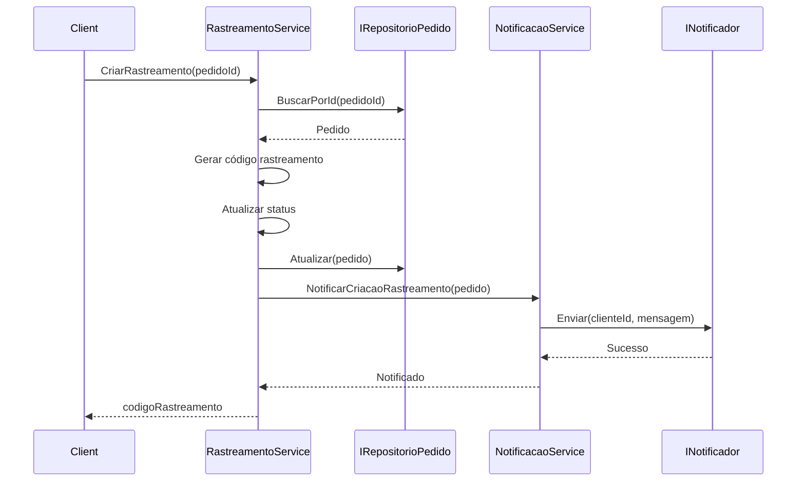
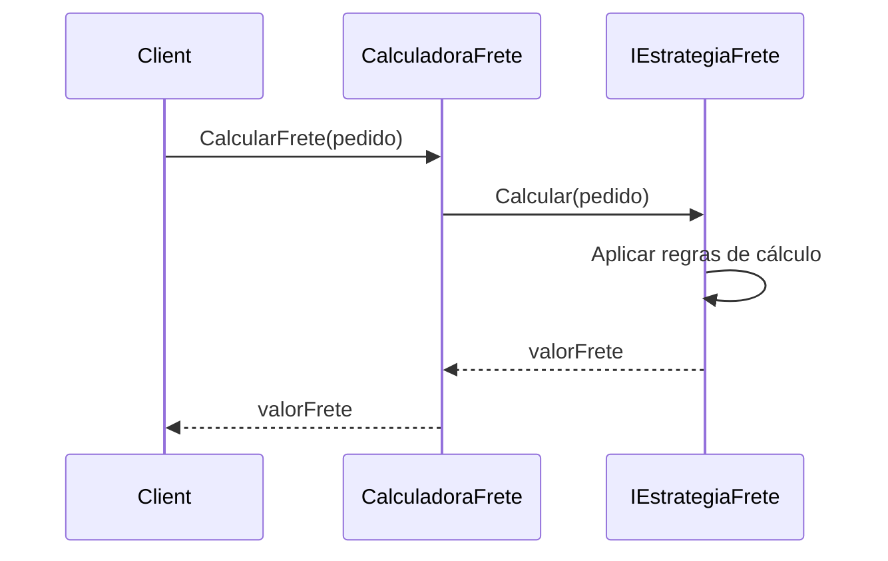
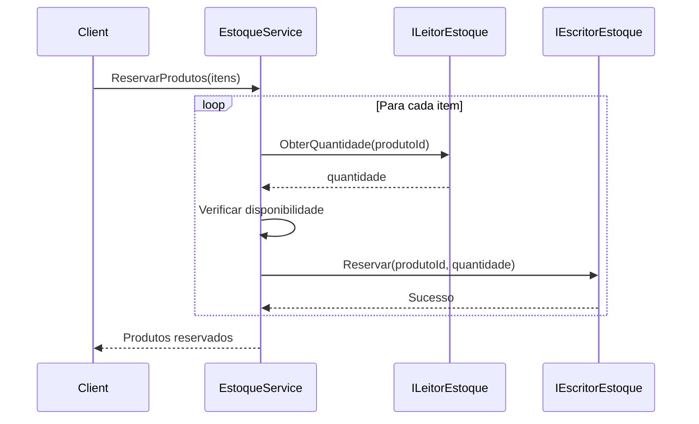

# 📚 Microsserviço de Logística - Documentação Explicativa

Esta documentação explica detalhadamente como cada princípio SOLID foi aplicado no microsserviço de logística, incluindo diagramas, fluxos e exemplos práticos.

## 📋 Índice

1. [Visão Geral da Arquitetura](#visão-geral-da-arquitetura)
2. [Aplicação dos Princípios SOLID](#aplicação-dos-princípios-solid)
3. [Fluxos de Requisições](#fluxos-de-requisições)
4. [Extensibilidade](#extensibilidade)
5. [Testabilidade](#testabilidade)
6. [Benefícios Práticos](#benefícios-práticos)

---

## 🏗️ Visão Geral da Arquitetura

O microsserviço de logística foi projetado seguindo os princípios SOLID para garantir:
- **Separação de responsabilidades** claras
- **Extensibilidade** sem modificar código existente
- **Testabilidade** de cada componente isoladamente
- **Flexibilidade** para trocar implementações

### Diagrama de Arquitetura

```mermaid
graph TB
    subgraph "Domain Layer"
        Pedido[Pedido]
        ItemPedido[ItemPedido]
        Endereco[Endereco]
        StatusEntrega[StatusEntrega]
    end

    subgraph "Services Layer - SRP"
        RastreamentoService[RastreamentoService]
        CalculadoraFrete[CalculadoraFrete]
        EstoqueService[EstoqueService]
        NotificacaoService[NotificacaoService]
    end

    subgraph "Strategies Layer - OCP"
        IEstrategiaFrete[IEstrategiaFrete]
        FretePadrao[FretePadrao]
        FreteExpresso[FreteExpresso]
        FreteEconomico[FreteEconomico]
    end

    subgraph "Repositories Layer - DIP/ISP"
        IRepositorioPedido[IRepositorioPedido]
        ILeitorEstoque[ILeitorEstoque]
        IEscritorEstoque[IEscritorEstoque]
        RepositorioPedidoBD[RepositorioPedidoBD]
        LeitorEstoqueBD[LeitorEstoqueBD]
        EscritorEstoqueBD[EscritorEstoqueBD]
    end

    subgraph "Notifications Layer - OCP/LSP/ISP"
        INotificador[INotificador]
        NotificadorEmail[NotificadorEmail]
        NotificadorSMS[NotificadorSMS]
        NotificadorPush[NotificadorPush]
    end

    RastreamentoService --> IRepositorioPedido
    RastreamentoService --> NotificacaoService
    CalculadoraFrete --> IEstrategiaFrete
    EstoqueService --> ILeitorEstoque
    EstoqueService --> IEscritorEstoque
    NotificacaoService --> INotificador

    IEstrategiaFrete <|.. FretePadrao
    IEstrategiaFrete <|.. FreteExpresso
    IEstrategiaFrete <|.. FreteEconomico

    IRepositorioPedido <|.. RepositorioPedidoBD
    ILeitorEstoque <|.. LeitorEstoqueBD
    IEscritorEstoque <|.. EscritorEstoqueBD

    INotificador <|.. NotificadorEmail
    INotificador <|.. NotificadorSMS
    INotificador <|.. NotificadorPush
```

### Camadas da Arquitetura

1. **Domain Layer**: Entidades de domínio (Pedido, ItemPedido, Endereco)
2. **Services Layer**: Serviços de aplicação com responsabilidades únicas (SRP)
3. **Strategies Layer**: Estratégias de cálculo extensíveis (OCP)
4. **Repositories Layer**: Abstrações de persistência (DIP, ISP)
5. **Notifications Layer**: Sistema de notificações extensível (OCP, LSP, ISP)

---

## 🎯 Aplicação dos Princípios SOLID

### 1. SRP - Single Responsibility Principle

**Princípio**: Uma classe deve ter apenas uma razão para mudar.

#### Aplicação no Microsserviço

Cada serviço tem uma única responsabilidade bem definida:

| Serviço | Responsabilidade Única |
|---------|----------------------|
| `RastreamentoService` | Gerenciar rastreamento de pedidos (criar, atualizar status, consultar) |
| `CalculadoraFrete` | Calcular valor do frete |
| `EstoqueService` | Gerenciar estoque (verificar disponibilidade, reservar, liberar) |
| `NotificacaoService` | Orquestrar envio de notificações |

#### Exemplo de Violação (❌)

```csharp
// ❌ Violação do SRP: Múltiplas responsabilidades
public class ServicoLogistica
{
    public void ProcessarPedido(Pedido pedido)
    {
        // Responsabilidade 1: Rastreamento
        var codigo = GerarCodigoRastreamento();
        
        // Responsabilidade 2: Cálculo de frete
        var frete = CalcularFrete(pedido);
        
        // Responsabilidade 3: Gestão de estoque
        ReservarProdutos(pedido.Itens);
        
        // Responsabilidade 4: Notificações
        EnviarEmail(pedido.ClienteId);
    }
}
```

**Problemas**:
- Se precisar mudar cálculo de frete, pode afetar outras funcionalidades
- Difícil testar cada funcionalidade isoladamente
- Violação de responsabilidade única

#### Solução Aplicando SRP (✅)

```csharp
// ✅ Cada serviço com responsabilidade única
public class RastreamentoService
{
    // Apenas rastreamento
    public string CriarRastreamento(string pedidoId) { }
    public void AtualizarStatus(string codigo, StatusEntrega status) { }
}

public class CalculadoraFrete
{
    // Apenas cálculo de frete
    public decimal CalcularFrete(Pedido pedido) { }
}

public class EstoqueService
{
    // Apenas gestão de estoque
    public void ReservarProdutos(List<ItemPedido> itens) { }
}
```

**Benefícios**:
- Mudanças isoladas: alterar cálculo de frete não afeta rastreamento
- Testes focados: cada serviço pode ser testado independentemente
- Código mais claro e fácil de entender

---

### 2. OCP - Open/Closed Principle

**Princípio**: Entidades devem estar abertas para extensão, mas fechadas para modificação.

#### Aplicação no Microsserviço

O sistema permite adicionar novas funcionalidades sem modificar código existente:

1. **Estratégias de Frete** (`IEstrategiaFrete`)
   - Pode adicionar `FreteGratis`, `FreteInternacional` sem modificar `CalculadoraFrete`

2. **Canais de Notificação** (`INotificador`)
   - Pode adicionar `NotificadorWhatsApp`, `NotificadorTelegram` sem modificar `NotificacaoService`

#### Exemplo de Violação (❌)

```csharp
// ❌ Violação do OCP: Precisa modificar para adicionar novo tipo de frete
public class CalculadoraFrete
{
    public decimal CalcularFrete(Pedido pedido, string tipoFrete)
    {
        if (tipoFrete == "Padrao")
            return 10.00m + (2.00m * pedido.Itens.Count);
        
        if (tipoFrete == "Expresso")
            return 25.00m + (5.00m * pedido.Itens.Count);
        
        // ❌ Precisa modificar esta classe para adicionar "Economico"
        if (tipoFrete == "Economico")
            return 5.00m + (1.00m * pedido.Itens.Count);
        
        throw new Exception("Tipo de frete não suportado");
    }
}
```

**Problemas**:
- Cada novo tipo de frete requer modificar `CalculadoraFrete`
- Risco de quebrar código existente
- Violação do princípio aberto/fechado

#### Solução Aplicando OCP (✅)

```csharp
// ✅ Interface que permite extensão sem modificação
public interface IEstrategiaFrete
{
    decimal Calcular(Pedido pedido);
}

public class CalculadoraFrete
{
    private readonly IEstrategiaFrete _estrategia;
    
    // Fechado para modificação, aberto para extensão
    public CalculadoraFrete(IEstrategiaFrete estrategia)
    {
        _estrategia = estrategia;
    }
    
    public decimal CalcularFrete(Pedido pedido)
    {
        return _estrategia.Calcular(pedido);
    }
}

// ✅ Nova estratégia adicionada SEM modificar CalculadoraFrete
public class FreteGratis : IEstrategiaFrete
{
    public decimal Calcular(Pedido pedido)
    {
        var total = pedido.Itens.Sum(i => i.PrecoUnitario * i.Quantidade);
        return total >= 200.00m ? 0.00m : new FretePadrao().Calcular(pedido);
    }
}
```

**Benefícios**:
- Extensibilidade: novos tipos de frete sem modificar código existente
- Estabilidade: código existente não é alterado
- Flexibilidade: fácil trocar estratégias em tempo de execução

---

### 3. LSP - Liskov Substitution Principle

**Princípio**: Objetos de uma superclasse devem ser substituíveis por objetos de suas subclasses sem quebrar a aplicação.

#### Aplicação no Microsserviço

Todas as implementações de interfaces podem ser substituídas sem quebrar o comportamento:

1. **Notificadores** (`INotificador`)
   - `NotificadorEmail`, `NotificadorSMS`, `NotificadorPush` são totalmente substituíveis

2. **Estratégias de Frete** (`IEstrategiaFrete`)
   - `FretePadrao`, `FreteExpresso`, `FreteEconomico` são totalmente substituíveis

#### Exemplo de Violação (❌)

```csharp
// ❌ Violação do LSP: NotificadorEmail não pode substituir INotificador corretamente
public interface INotificador
{
    void Enviar(string destinatario, string mensagem);
}

public class NotificadorEmail : INotificador
{
    public void Enviar(string destinatario, string mensagem)
    {
        // ❌ Lança exceção se email inválido, quebrando contrato
        if (!destinatario.Contains("@"))
            throw new Exception("Email inválido");
        
        // Envia email...
    }
}

public class NotificadorSMS : INotificador
{
    public void Enviar(string destinatario, string mensagem)
    {
        // ❌ Comportamento diferente: não valida formato
        // Envia SMS...
    }
}
```

**Problemas**:
- Comportamentos inconsistentes entre implementações
- Quebra de contrato da interface
- Substituição pode causar erros inesperados

#### Solução Aplicando LSP (✅)

```csharp
// ✅ Todas as implementações seguem o mesmo contrato
public interface INotificador
{
    void Enviar(string destinatario, string mensagem);
    string Canal { get; }
}

public class NotificadorEmail : INotificador
{
    public string Canal => "Email";
    
    public void Enviar(string destinatario, string mensagem)
    {
        // ✅ Comportamento consistente: sempre envia, mesmo com dados inválidos
        Console.WriteLine($"[EMAIL] Para: {destinatario}");
        Console.WriteLine($"[EMAIL] Mensagem: {mensagem}");
    }
}

public class NotificadorSMS : INotificador
{
    public string Canal => "SMS";
    
    public void Enviar(string destinatario, string mensagem)
    {
        // ✅ Comportamento consistente: mesmo padrão
        Console.WriteLine($"[SMS] Para: {destinatario}");
        Console.WriteLine($"[SMS] Mensagem: {mensagem}");
    }
}

// ✅ Uso: qualquer implementação pode ser substituída
public class NotificacaoService
{
    private readonly List<INotificador> _notificadores;
    
    public void Notificar(string destinatario, string mensagem)
    {
        // ✅ LSP: Qualquer INotificador funciona aqui
        foreach (var notificador in _notificadores)
        {
            notificador.Enviar(destinatario, mensagem);
        }
    }
}
```

**Benefícios**:
- Substituição segura: qualquer implementação pode ser usada
- Comportamento previsível: todas seguem o mesmo contrato
- Flexibilidade: fácil trocar implementações

---

### 4. ISP - Interface Segregation Principle

**Princípio**: Clientes não devem ser forçados a depender de interfaces que não usam.

#### Aplicação no Microsserviço

Interfaces segregadas por responsabilidade:

1. **Estoque**: `ILeitorEstoque` e `IEscritorEstoque` separados
2. **Notificações**: `INotificador` simples, sem métodos desnecessários

#### Exemplo de Violação (❌)

```csharp
// ❌ Violação do ISP: Interface monolítica
public interface IEstoque
{
    // Métodos de leitura
    int ObterQuantidade(string produtoId);
    bool VerificarDisponibilidade(string produtoId, int quantidade);
    
    // Métodos de escrita
    void Reservar(string produtoId, int quantidade);
    void LiberarReserva(string produtoId, int quantidade);
    void AtualizarQuantidade(string produtoId, int quantidade);
    
    // Métodos de configuração (não usados por todos)
    void ConfigurarLimiteMinimo(string produtoId, int limite);
    void ConfigurarAlerta(string produtoId, bool ativo);
}

// ❌ Cliente que só precisa ler é forçado a implementar escrita
public class RelatorioEstoque : IEstoque
{
    public int ObterQuantidade(string produtoId) { }
    
    // ❌ Forçado a implementar métodos que não usa
    public void Reservar(string produtoId, int quantidade) 
    { 
        throw new NotImplementedException(); 
    }
    // ... outros métodos não usados
}
```

**Problemas**:
- Clientes forçados a implementar métodos que não usam
- Interfaces grandes e difíceis de manter
- Acoplamento desnecessário

#### Solução Aplicando ISP (✅)

```csharp
// ✅ Interfaces segregadas por responsabilidade
public interface ILeitorEstoque
{
    int ObterQuantidade(string produtoId);
    bool VerificarDisponibilidade(string produtoId, int quantidade);
    Dictionary<string, int> ObterEstoqueCompleto();
}

public interface IEscritorEstoque
{
    void Reservar(string produtoId, int quantidade);
    void LiberarReserva(string produtoId, int quantidade);
    void AtualizarQuantidade(string produtoId, int quantidade);
}

// ✅ Cliente que só precisa ler implementa apenas ILeitorEstoque
public class RelatorioEstoque : ILeitorEstoque
{
    public int ObterQuantidade(string produtoId) { }
    public bool VerificarDisponibilidade(string produtoId, int quantidade) { }
    public Dictionary<string, int> ObterEstoqueCompleto() { }
}

// ✅ Cliente que só precisa escrever implementa apenas IEscritorEstoque
public class AtualizadorEstoque : IEscritorEstoque
{
    public void Reservar(string produtoId, int quantidade) { }
    public void LiberarReserva(string produtoId, int quantidade) { }
    public void AtualizarQuantidade(string produtoId, int quantidade) { }
}

// ✅ Cliente que precisa ambos implementa ambos
public class EstoqueService
{
    private readonly ILeitorEstoque _leitor;
    private readonly IEscritorEstoque _escritor;
    
    public EstoqueService(ILeitorEstoque leitor, IEscritorEstoque escritor)
    {
        _leitor = leitor;
        _escritor = escritor;
    }
}
```

**Benefícios**:
- Interfaces focadas: cada uma com responsabilidade clara
- Sem métodos desnecessários: clientes implementam apenas o que precisam
- Menor acoplamento: mudanças em escrita não afetam leitura

---

### 5. DIP - Dependency Inversion Principle

**Princípio**: Módulos de alto nível não devem depender de módulos de baixo nível. Ambos devem depender de abstrações.

#### Aplicação no Microsserviço

Todos os serviços dependem de interfaces, não de implementações concretas:

1. **Serviços** dependem de `IRepositorioPedido`, `ILeitorEstoque`, `IEscritorEstoque`
2. **NotificacaoService** depende de `INotificador`
3. **CalculadoraFrete** depende de `IEstrategiaFrete`

#### Exemplo de Violação (❌)

```csharp
// ❌ Violação do DIP: Alto nível depende de baixo nível
public class RastreamentoService
{
    // ❌ Dependência direta de implementação concreta
    private readonly RepositorioPedidoBD _repositorio;
    
    public RastreamentoService()
    {
        // ❌ Criação hardcoded de dependência
        _repositorio = new RepositorioPedidoBD();
    }
    
    public void CriarRastreamento(string pedidoId)
    {
        var pedido = _repositorio.BuscarPorId(pedidoId);
        // ...
    }
}
```

**Problemas**:
- Difícil testar: não pode mockar `RepositorioPedidoBD`
- Acoplamento forte: mudança no repositório afeta o serviço
- Inflexível: não pode trocar implementação facilmente

#### Solução Aplicando DIP (✅)

```csharp
// ✅ DIP: Alto nível depende de abstração
public class RastreamentoService
{
    // ✅ Dependência de interface (abstração)
    private readonly IRepositorioPedido _repositorio;
    private readonly INotificacaoService _notificacaoService;
    
    // ✅ Injeção de dependência via construtor
    public RastreamentoService(
        IRepositorioPedido repositorio,
        INotificacaoService notificacaoService)
    {
        _repositorio = repositorio;
        _notificacaoService = notificacaoService;
    }
    
    public string CriarRastreamento(string pedidoId)
    {
        // ✅ Usa abstração, não implementação concreta
        var pedido = _repositorio.BuscarPorId(pedidoId);
        // ...
    }
}

// ✅ Composição no alto nível (Program.cs)
var repositorio = new RepositorioPedidoBD(); // Implementação concreta
var notificacaoService = new NotificacaoService(notificadores);
var rastreamentoService = new RastreamentoService(repositorio, notificacaoService);
```

**Benefícios**:
- Testabilidade: fácil criar mocks para testes
- Flexibilidade: pode trocar implementações facilmente
- Desacoplamento: serviços não conhecem detalhes de implementação

---

## 🔄 Fluxos de Requisições

### Fluxo: Criar Rastreamento de Pedido



### Fluxo: Calcular Frete



### Fluxo: Reservar Produtos



---

## 🔧 Extensibilidade

### Como Adicionar Novo Tipo de Frete (OCP)

```csharp
// 1. Criar nova estratégia implementando IEstrategiaFrete
public class FreteInternacional : IEstrategiaFrete
{
    public string TipoFrete => "Internacional";
    
    public decimal Calcular(Pedido pedido)
    {
        // Lógica específica para frete internacional
        decimal valorBase = 100.00m;
        decimal valorPorItem = 10.00m;
        decimal totalItens = pedido.Itens.Sum(item => item.Quantidade);
        
        return valorBase + (valorPorItem * totalItens);
    }
}

// 2. Usar a nova estratégia (sem modificar CalculadoraFrete)
var freteInternacional = new FreteInternacional();
var calculadora = new CalculadoraFrete(freteInternacional);
var valor = calculadora.CalcularFrete(pedido);
```

**✅ Não foi necessário modificar `CalculadoraFrete`!**

### Como Adicionar Novo Canal de Notificação (OCP, LSP)

```csharp
// 1. Criar novo notificador implementando INotificador
public class NotificadorTelegram : INotificador
{
    public string Canal => "Telegram";
    
    public void Enviar(string destinatario, string mensagem)
    {
        // Lógica específica para Telegram
        Console.WriteLine($"[TELEGRAM] Para: {destinatario}");
        Console.WriteLine($"[TELEGRAM] Mensagem: {mensagem}");
    }
}

// 2. Adicionar à lista de notificadores (sem modificar NotificacaoService)
var notificadores = new List<INotificador>
{
    new NotificadorEmail(),
    new NotificadorSMS(),
    new NotificadorPush(),
    new NotificadorTelegram() // ✅ Novo canal adicionado
};

var notificacaoService = new NotificacaoService(notificadores);
```

**✅ Não foi necessário modificar `NotificacaoService`!**

---

## 🧪 Testabilidade

### Teste Unitário: RastreamentoService

```csharp
[Test]
public void CriarRastreamento_DeveGerarCodigoUnico()
{
    // Arrange - DIP: Usa mocks das dependências
    var mockRepositorio = new Mock<IRepositorioPedido>();
    var mockNotificacao = new Mock<INotificacaoService>();
    var pedido = new Pedido { Id = "PED001" };
    
    mockRepositorio.Setup(r => r.BuscarPorId("PED001")).Returns(pedido);
    
    var service = new RastreamentoService(mockRepositorio.Object, mockNotificacao.Object);
    
    // Act
    var codigo = service.CriarRastreamento("PED001");
    
    // Assert
    Assert.IsNotNull(codigo);
    Assert.IsTrue(codigo.StartsWith("TRK"));
    mockRepositorio.Verify(r => r.Atualizar(It.IsAny<Pedido>()), Times.Once);
    mockNotificacao.Verify(n => n.NotificarCriacaoRastreamento(It.IsAny<Pedido>()), Times.Once);
}
```

### Teste Unitário: CalculadoraFrete com Diferentes Estratégias

```csharp
[Test]
public void CalcularFrete_ComFreteExpresso_DeveRetornarValorMaior()
{
    // Arrange
    var estrategia = new FreteExpresso();
    var calculadora = new CalculadoraFrete(estrategia);
    var pedido = new Pedido
    {
        Itens = new List<ItemPedido>
        {
            new ItemPedido { Quantidade = 2 }
        }
    };
    
    // Act
    var valor = calculadora.CalcularFrete(pedido);
    
    // Assert
    Assert.AreEqual(35.00m, valor); // 25 + (5 * 2)
}

[Test]
public void CalcularFrete_ComFreteEconomico_DeveRetornarValorMenor()
{
    // Arrange
    var estrategia = new FreteEconomico();
    var calculadora = new CalculadoraFrete(estrategia);
    var pedido = new Pedido
    {
        Itens = new List<ItemPedido>
        {
            new ItemPedido { Quantidade = 2 }
        }
    };
    
    // Act
    var valor = calculadora.CalcularFrete(pedido);
    
    // Assert
    Assert.AreEqual(7.00m, valor); // 5 + (1 * 2)
}
```

**Benefícios da Testabilidade**:
- Cada componente pode ser testado isoladamente
- Mocks facilitam testes sem dependências externas
- Testes rápidos e determinísticos

---

## 💡 Benefícios Práticos

### 1. Manutenibilidade

**Antes (sem SOLID)**:
- Mudança em cálculo de frete pode afetar rastreamento
- Difícil localizar onde fazer alterações
- Risco de quebrar funcionalidades relacionadas

**Depois (com SOLID)**:
- Mudanças isoladas: alterar frete não afeta rastreamento
- Responsabilidades claras: fácil encontrar onde fazer alterações
- Menor risco de quebrar código relacionado

### 2. Extensibilidade

**Antes (sem SOLID)**:
- Adicionar novo tipo de frete requer modificar múltiplas classes
- Risco de introduzir bugs em código existente

**Depois (com SOLID)**:
- Adicionar novo tipo de frete: apenas criar nova classe
- Código existente não é modificado
- Extensão segura e isolada

### 3. Testabilidade

**Antes (sem SOLID)**:
- Testes complexos com muitas dependências
- Difícil isolar componentes para teste

**Depois (com SOLID)**:
- Testes unitários focados em cada componente
- Mocks facilitam isolamento
- Testes rápidos e confiáveis

### 4. Flexibilidade

**Antes (sem SOLID)**:
- Trocar banco de dados requer modificar serviços
- Difícil trocar implementações

**Depois (com SOLID)**:
- Trocar banco: apenas trocar implementação do repositório
- Serviços não precisam ser modificados
- Flexibilidade para escolher implementações

### 5. Reutilização

**Antes (sem SOLID)**:
- Código acoplado dificulta reutilização
- Componentes não podem ser usados isoladamente

**Depois (com SOLID)**:
- Componentes podem ser reutilizados em diferentes contextos
- Interfaces permitem múltiplas implementações
- Código modular e reutilizável

---

## 📊 Comparação: Com vs Sem SOLID

| Aspecto | Sem SOLID | Com SOLID |
|---------|-----------|-----------|
| **Manutenibilidade** | Mudanças afetam múltiplas áreas | Mudanças isoladas |
| **Extensibilidade** | Precisa modificar código existente | Adiciona sem modificar |
| **Testabilidade** | Testes complexos e acoplados | Testes unitários isolados |
| **Flexibilidade** | Difícil trocar implementações | Fácil trocar implementações |
| **Reutilização** | Código acoplado | Componentes reutilizáveis |
| **Complexidade** | Alta (código entrelaçado) | Baixa (responsabilidades claras) |

---

## 🎓 Conclusão

O microsserviço de logística demonstra como os princípios SOLID trabalham juntos para criar um sistema:

- **Manutenível**: Fácil de entender e modificar
- **Extensível**: Pode crescer sem quebrar código existente
- **Testável**: Cada componente pode ser testado isoladamente
- **Flexível**: Pode adaptar-se a diferentes necessidades
- **Reutilizável**: Componentes podem ser usados em diferentes contextos

A aplicação dos princípios SOLID não é apenas teórica, mas traz benefícios práticos reais para o desenvolvimento e manutenção de software.

---

## 📚 Referências

- [Código Completo do Microsserviço](./microsservico-logistica-codigo.md)
- [Princípios SOLID - Introdução](../00-introducao.md)
- [Single Responsibility Principle](../01-single-responsibility.md)
- [Open/Closed Principle](../02-open-closed.md)
- [Liskov Substitution Principle](../03-liskov-substitution.md)
- [Interface Segregation Principle](../04-interface-segregation.md)
- [Dependency Inversion Principle](../05-dependency-inversion.md)

---

[← Voltar para recursos](../README.md) | [Ver código completo](./microsservico-logistica-codigo.md)
